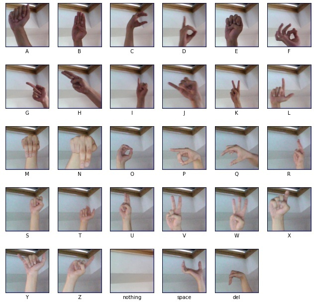
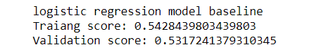

# Sign Language Recognition 
The goal of this project is to build a Convolution Neural Network(CNN) 
deep learning models that decide which is the letter based on the shape of the hand in sign language
and bridging the gap in the process of communication between the Deaf and Dumb people with the rest of the world.
## Sample of Dataset

## Workflow
* Baseline Model "Logestic Regresstion" :

 

After visualizing the data, we started to prepare it for the baseline model. The data image comes with 4 dimensions first we reshaped data to 2-dimensional data and then we built a logistic regression model. The score is very low as we expected 0.54 on training and 0.53 on validation. Now we will be starting to build a neural network model and try to get better results on both training and validation.
* Neural Network
* Convolutional Neural Network(CNN)
* Transfer Learning 
## Next step 
* We will use Real-Time Sign Language Detection with Tensorflow Object Detection and Python 
